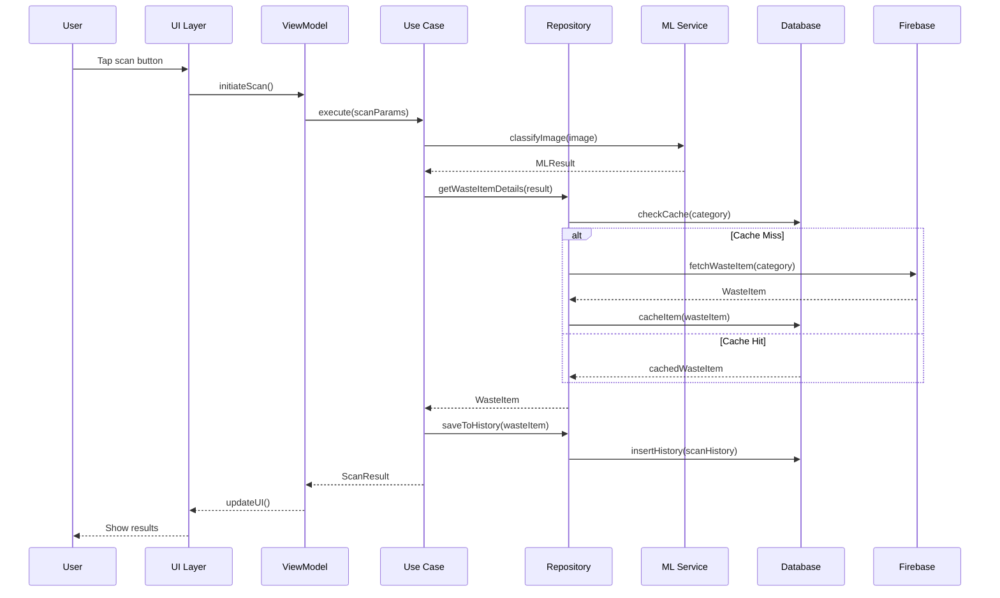
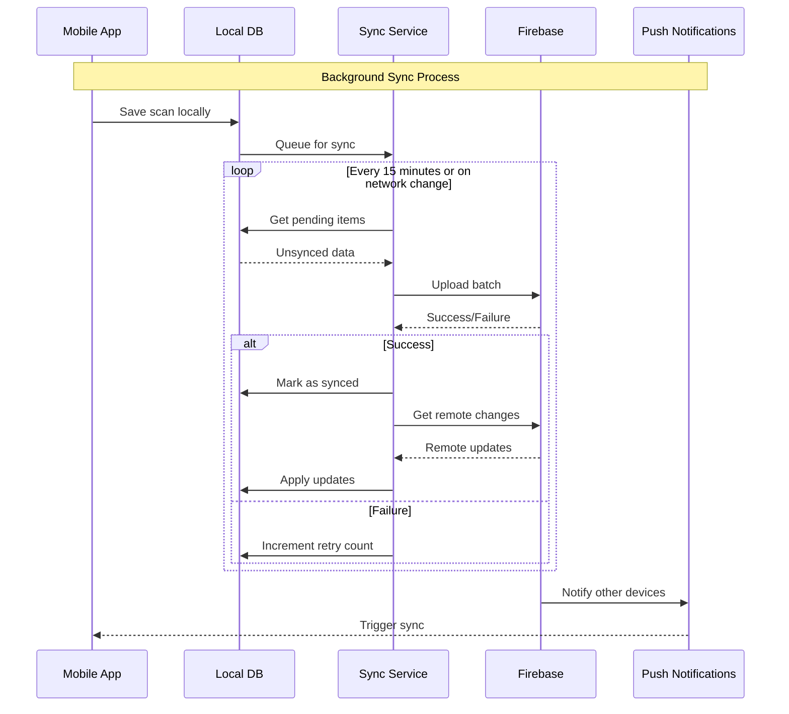

# System Architecture - Waste Sorting Assistant

## Overview
This document outlines the comprehensive system architecture for the Waste Sorting Assistant mobile application, including component design, data flow, integration patterns, and deployment architecture.

## 1. High-Level Architecture

```
┌─────────────────────────────────────────────────────────────────┐
│                        PRESENTATION LAYER                       │
├─────────────────┬─────────────────┬─────────────────────────────┤
│   Flutter UI    │   State Mgmt    │      Navigation             │
│   - Screens     │   - Provider    │      - App Routes           │
│   - Widgets     │   - ViewModels  │      - Route Guards         │
│   - Themes      │   - State       │      - Deep Linking         │
└─────────────────┴─────────────────┴─────────────────────────────┘
                            │
┌─────────────────────────────────────────────────────────────────┐
│                        DOMAIN LAYER                             │
├─────────────────┬─────────────────┬─────────────────────────────┤
│   Entities      │   Use Cases     │      Repositories           │
│   - User        │   - Auth        │      - Interfaces           │
│   - WasteItem   │   - Scanning    │      - Contracts            │
│   - ScanHistory │   - Data Sync   │      - Domain Logic         │
└─────────────────┴─────────────────┴─────────────────────────────┘
                            │
┌─────────────────────────────────────────────────────────────────┐
│                         DATA LAYER                              │
├─────────────────┬─────────────────┬─────────────────────────────┤
│  Repositories   │  Data Sources   │      Models                 │
│  - UserRepo     │  - Local DB     │      - Data Models          │
│  - WasteRepo    │  - Remote API   │      - Entity Mappers       │
│  - ScanRepo     │  - Cache        │      - JSON Serialization   │
└─────────────────┴─────────────────┴─────────────────────────────┘
                            │
┌─────────────────────────────────────────────────────────────────┐
│                      SERVICES LAYER                             │
├─────────────────┬─────────────────┬─────────────────────────────┤
│  External APIs  │   Device APIs   │      Core Services          │
│  - Firebase     │   - Camera      │      - Auth Service         │
│  - ML Kit       │   - Storage     │      - Network Service      │
│  - Analytics    │   - Location    │      - Cache Service        │
└─────────────────┴─────────────────┴─────────────────────────────┘
```

## 2. Detailed Component Architecture

### 2.1 Presentation Layer

#### Flutter UI Components
```dart
lib/presentation/
├── screens/
│   ├── auth/
│   │   ├── login_screen.dart
│   │   ├── register_screen.dart
│   │   └── profile_screen.dart
│   ├── scan/
│   │   ├── camera_screen.dart
│   │   ├── results_screen.dart
│   │   └── history_screen.dart
│   └── dashboard/
│       ├── home_screen.dart
│       └── statistics_screen.dart
├── widgets/
│   ├── common/
│   │   ├── app_bar.dart
│   │   ├── bottom_navigation.dart
│   │   └── loading_indicator.dart
│   ├── scan/
│   │   ├── camera_overlay.dart
│   │   ├── scan_result_card.dart
│   │   └── category_badge.dart
│   └── stats/
│       ├── chart_widget.dart
│       └── progress_indicator.dart
└── theme/
    ├── app_theme.dart
    ├── colors.dart
    └── text_styles.dart
```

#### State Management Pattern
```dart
// ViewModels following MVVM pattern
abstract class BaseViewModel extends ChangeNotifier {
  bool _isLoading = false;
  String? _errorMessage;

  bool get isLoading => _isLoading;
  String? get errorMessage => _errorMessage;

  void setLoading(bool loading) {
    _isLoading = loading;
    notifyListeners();
  }

  void setError(String? error) {
    _errorMessage = error;
    notifyListeners();
  }
}

class ScanViewModel extends BaseViewModel {
  final ScanUseCase _scanUseCase;
  final CameraService _cameraService;

  ScanResult? _currentResult;
  List<ScanHistory> _history = [];

  // Business logic methods
  Future<void> scanImage(XFile image) async {
    setLoading(true);
    try {
      _currentResult = await _scanUseCase.execute(image);
      notifyListeners();
    } catch (e) {
      setError(e.toString());
    } finally {
      setLoading(false);
    }
  }
}
```

### 2.2 Domain Layer

#### Core Entities
```dart
// Domain Entities
class User {
  final String id;
  final String email;
  final String? displayName;
  final String? profileImageUrl;
  final DateTime createdAt;
  final UserPreferences preferences;
}

class WasteItem {
  final String id;
  final String category;
  final String subcategory;
  final double confidence;
  final String imageUrl;
  final SortingInstructions instructions;
  final EnvironmentalImpact impact;
}

class ScanHistory {
  final String id;
  final String userId;
  final WasteItem wasteItem;
  final DateTime scannedAt;
  final Location? location;
  final bool isCorrect;
}
```

#### Use Cases (Business Logic)
```dart
abstract class UseCase<Type, Params> {
  Future<Result<Type, Failure>> execute(Params params);
}

class ScanWasteUseCase implements UseCase<WasteItem, ScanParams> {
  final WasteRepository _repository;
  final MLService _mlService;
  final CacheService _cacheService;

  @override
  Future<Result<WasteItem, Failure>> execute(ScanParams params) async {
    try {
      // 1. Preprocess image
      final processedImage = await _preprocessImage(params.image);

      // 2. Check cache first
      final cacheKey = await _generateImageHash(processedImage);
      final cached = await _cacheService.get(cacheKey);
      if (cached != null) {
        return Result.success(cached);
      }

      // 3. Run ML recognition
      final mlResult = await _mlService.classifyImage(processedImage);

      // 4. Get sorting instructions
      final wasteItem = await _repository.getWasteItemDetails(mlResult);

      // 5. Cache result
      await _cacheService.set(cacheKey, wasteItem);

      // 6. Save to history
      await _repository.saveToHistory(wasteItem);

      return Result.success(wasteItem);
    } catch (e) {
      return Result.failure(ScanFailure(e.toString()));
    }
  }
}
```

### 2.3 Data Layer

#### Repository Pattern Implementation
```dart
abstract class WasteRepository {
  Future<WasteItem> getWasteItemDetails(MLResult result);
  Future<List<ScanHistory>> getScanHistory(String userId);
  Future<void> saveToHistory(WasteItem item);
  Future<void> syncWithCloud();
}

class WasteRepositoryImpl implements WasteRepository {
  final LocalDataSource _localDS;
  final RemoteDataSource _remoteDS;
  final NetworkInfo _networkInfo;

  @override
  Future<WasteItem> getWasteItemDetails(MLResult result) async {
    try {
      if (await _networkInfo.isConnected) {
        // Try remote first for latest data
        final remoteItem = await _remoteDS.getWasteItem(result.category);
        await _localDS.cacheWasteItem(remoteItem);
        return remoteItem;
      } else {
        // Fallback to local cache
        return await _localDS.getWasteItem(result.category);
      }
    } catch (e) {
      // Fallback to local if remote fails
      return await _localDS.getWasteItem(result.category);
    }
  }

  @override
  Future<void> syncWithCloud() async {
    if (await _networkInfo.isConnected) {
      final localChanges = await _localDS.getPendingSync();
      for (final change in localChanges) {
        await _remoteDS.syncChange(change);
        await _localDS.markSynced(change.id);
      }
    }
  }
}
```

#### Data Sources
```dart
// Local Data Source
class LocalDataSource {
  final Database _database;

  Future<List<ScanHistory>> getScanHistory(String userId) async {
    final maps = await _database.query(
      'scan_history',
      where: 'user_id = ? AND synced = 1',
      whereArgs: [userId],
      orderBy: 'scanned_at DESC',
    );
    return maps.map((map) => ScanHistory.fromMap(map)).toList();
  }
}

// Remote Data Source
class RemoteDataSource {
  final FirebaseFirestore _firestore;
  final FirebaseAuth _auth;

  Future<WasteItem> getWasteItem(String category) async {
    final doc = await _firestore
        .collection('waste_items')
        .doc(category)
        .get();
    return WasteItem.fromFirestore(doc);
  }
}
```

## 3. Service Architecture

### 3.1 ML Service Integration
```dart
class MLService {
  final ImageLabeler _onDeviceLabeler;
  final ImageLabeler? _cloudLabeler;

  Future<MLResult> classifyImage(File image) async {
    try {
      // Try on-device first for speed
      final onDeviceResults = await _onDeviceLabeler.processImage(
        InputImage.fromFile(image)
      );

      if (_hasHighConfidence(onDeviceResults)) {
        return _convertToMLResult(onDeviceResults);
      }

      // Fall back to cloud for better accuracy
      if (_cloudLabeler != null && await _hasNetworkConnection()) {
        final cloudResults = await _cloudLabeler!.processImage(
          InputImage.fromFile(image)
        );
        return _convertToMLResult(cloudResults);
      }

      return _convertToMLResult(onDeviceResults);
    } catch (e) {
      throw MLException('Failed to classify image: ${e.toString()}');
    }
  }
}
```

### 3.2 Firebase Integration Architecture
```dart
class FirebaseService {
  // Authentication
  Future<User> authenticateUser(String email, String password) async {
    final credential = await FirebaseAuth.instance
        .signInWithEmailAndPassword(email: email, password: password);
    return _convertFirebaseUser(credential.user!);
  }

  // Firestore Data Operations
  Future<void> saveUserData(User user) async {
    await FirebaseFirestore.instance
        .collection('users')
        .doc(user.id)
        .set(user.toMap());
  }

  // Cloud Storage
  Future<String> uploadImage(File image, String path) async {
    final ref = FirebaseStorage.instance.ref().child(path);
    final uploadTask = ref.putFile(image);
    final snapshot = await uploadTask;
    return await snapshot.ref.getDownloadURL();
  }

  // Analytics
  void trackEvent(String event, Map<String, dynamic> parameters) {
    FirebaseAnalytics.instance.logEvent(
      name: event,
      parameters: parameters,
    );
  }
}
```

## 4. Security Architecture

### 4.1 Authentication & Authorization Flow
```
┌─────────┐    ┌─────────────┐    ┌─────────────┐    ┌─────────────┐
│  Client │    │   Firebase  │    │  Firestore  │    │   Storage   │
│   App   │    │    Auth     │    │  Database   │    │   Bucket    │
└────┬────┘    └──────┬──────┘    └──────┬──────┘    └──────┬──────┘
     │                │                  │                  │
     │ 1. Login       │                  │                  │
     ├────────────────▶                  │                  │
     │                │                  │                  │
     │ 2. ID Token    │                  │                  │
     ◀────────────────┤                  │                  │
     │                │                  │                  │
     │ 3. Authenticated Request          │                  │
     ├───────────────────────────────────▶                  │
     │                │                  │                  │
     │ 4. Security Rules Check          │                  │
     │                │                  ├─────────────────▶│
     │                │                  │                  │
     │ 5. Data Response                  │                  │
     ◀───────────────────────────────────┤                  │
```

### 4.2 Data Security Measures
```dart
class SecurityService {
  // Encrypt sensitive local data
  Future<String> encryptData(String data) async {
    final key = await _getEncryptionKey();
    final encrypted = await Encrypt.encrypt(data, key);
    return encrypted;
  }

  // Secure key storage
  Future<String> _getEncryptionKey() async {
    const storage = FlutterSecureStorage();
    String? key = await storage.read(key: 'encryption_key');

    if (key == null) {
      key = _generateRandomKey();
      await storage.write(key: 'encryption_key', value: key);
    }

    return key;
  }

  // Validate image before processing
  bool validateImageSecurity(File image) {
    // Check file type
    if (!_isValidImageType(image)) return false;

    // Check file size
    if (image.lengthSync() > AppConfig.maxImageSize) return false;

    // Basic malware check
    if (_containsSuspiciousData(image)) return false;

    return true;
  }
}
```

## 5. Data Flow Architecture

### 5.1 Scan Flow Sequence Diagram


### 5.2 Data Synchronization Flow


## 6. Deployment Architecture

### 6.1 Cloud Infrastructure
```
┌─────────────────────────────────────────────────────────────────┐
│                         FIREBASE CLOUD                          │
├─────────────────┬─────────────────┬─────────────────────────────┤
│   Authentication│    Firestore    │      Cloud Storage          │
│   - User Mgmt   │    - User Data  │      - Images               │
│   - ID Tokens   │    - Scan Data  │      - ML Models            │
│   - Security    │    - Analytics  │      - App Assets           │
└─────────────────┴─────────────────┴─────────────────────────────┘
                            │
┌─────────────────────────────────────────────────────────────────┐
│                      GOOGLE CLOUD                               │
├─────────────────┬─────────────────┬─────────────────────────────┤
│   ML Kit APIs  │   Cloud Vision  │      Analytics              │
│   - On-device   │   - Advanced    │      - Firebase Analytics  │
│   - AutoML      │   - Custom      │      - Crashlytics         │
│   - Translation │   - Training    │      - Performance         │
└─────────────────┴─────────────────┴─────────────────────────────┘
                            │
┌─────────────────────────────────────────────────────────────────┐
│                         CDN & EDGE                              │
├─────────────────┬─────────────────┬─────────────────────────────┤
│   Cloud CDN     │   App Engine    │      Cloud Functions        │
│   - Asset Cache │   - API Gateway │      - Image Processing     │
│   - Global Edge │   - Rate Limit  │      - Notifications        │
│   - SSL/TLS     │   - Auth Proxy  │      - Data Processing      │
└─────────────────┴─────────────────┴─────────────────────────────┘
```

### 6.2 Mobile App Distribution
```
┌─────────────────────────────────────────────────────────────────┐
│                      DISTRIBUTION                               │
├─────────────────┬─────────────────┬─────────────────────────────┤
│  Google Play    │   App Store     │      Internal Testing       │
│  - Production   │   - Production  │      - Firebase App Dist    │
│  - Internal     │   - TestFlight  │      - APK Distribution     │
│  - Alpha/Beta   │   - Review      │      - QA Environment       │
└─────────────────┴─────────────────┴─────────────────────────────┘
                            │
┌─────────────────────────────────────────────────────────────────┐
│                       CI/CD PIPELINE                            │
├─────────────────┬─────────────────┬─────────────────────────────┤
│  GitHub Actions │   Build Matrix  │      Quality Gates          │
│  - Dev Build    │   - Android     │      - Tests Pass           │
│  - QA Deploy    │   - iOS         │      - Security Scan        │
│  - Prod Release │   - Multiple    │      - Performance Check    │
└─────────────────┴─────────────────┴─────────────────────────────┘
```

## 7. Performance Architecture

### 7.1 Caching Strategy
```dart
class CacheStrategy {
  // Multi-level caching
  static const Duration memoryTTL = Duration(minutes: 30);
  static const Duration diskTTL = Duration(hours: 24);
  static const Duration cloudTTL = Duration(days: 7);

  // Cache priority levels
  enum CachePriority { high, medium, low }

  // LRU implementation for memory cache
  final LRUCache<String, dynamic> _memoryCache;
  final Database _diskCache;
  final FirebaseFirestore _cloudCache;
}

// Image caching optimization
class ImageCacheManager {
  Future<void> preloadCommonImages() async {
    final commonCategories = await _getCommonCategories();
    for (final category in commonCategories) {
      await _preloadCategoryImages(category);
    }
  }

  Future<File> getCachedImage(String url) async {
    // Check memory → disk → network
    return await _getCachedImageWithFallback(url);
  }
}
```

### 7.2 Database Optimization
```sql
-- SQLite Schema with Optimizations
CREATE TABLE scan_history (
    id TEXT PRIMARY KEY,
    user_id TEXT NOT NULL,
    category TEXT NOT NULL,
    confidence REAL NOT NULL,
    scanned_at INTEGER NOT NULL,
    synced INTEGER DEFAULT 0,
    FOREIGN KEY (user_id) REFERENCES users (id)
);

-- Optimized indexes
CREATE INDEX idx_scan_history_user_date ON scan_history(user_id, scanned_at DESC);
CREATE INDEX idx_scan_history_sync ON scan_history(synced, user_id);
CREATE INDEX idx_scan_history_category ON scan_history(category);

-- Statistics aggregation view
CREATE VIEW user_stats AS
SELECT
    user_id,
    COUNT(*) as total_scans,
    COUNT(DISTINCT category) as unique_categories,
    AVG(confidence) as avg_confidence,
    MAX(scanned_at) as last_scan
FROM scan_history
GROUP BY user_id;
```

## 8. Error Handling Architecture

### 8.1 Exception Hierarchy
```dart
abstract class AppException implements Exception {
  final String message;
  final String code;
  final dynamic details;

  const AppException(this.message, this.code, [this.details]);
}

class NetworkException extends AppException {
  const NetworkException(String message) : super(message, 'NETWORK_ERROR');
}

class MLException extends AppException {
  const MLException(String message) : super(message, 'ML_ERROR');
}

// Global error handler
class GlobalErrorHandler {
  static void handleError(dynamic error, StackTrace stackTrace) {
    // Log to Firebase Crashlytics
    FirebaseCrashlytics.instance.recordError(error, stackTrace);

    // Log locally for debugging
    Logger.error('Global Error', error: error, stackTrace: stackTrace);

    // Show user-friendly message
    if (error is AppException) {
      NotificationService.showError(error.message);
    } else {
      NotificationService.showError('An unexpected error occurred');
    }
  }
}
```

## 9. Monitoring & Observability

### 9.1 Application Performance Monitoring
```dart
class PerformanceMonitor {
  static final FirebasePerformance _performance = FirebasePerformance.instance;

  static Trace startTrace(String name) {
    return _performance.newTrace(name);
  }

  static void trackScreenTime(String screenName, Duration duration) {
    _performance.newTrace('screen_$screenName')
      ..putAttribute('duration_ms', duration.inMilliseconds.toString())
      ..start()
      ..stop();
  }

  static void trackApiCall(String endpoint, Duration duration, bool success) {
    _performance.newHttpTrace(endpoint, HttpMethod.Post)
      ..responseCode = success ? 200 : 500
      ..responsePayloadSize = 1024
      ..stop();
  }
}
```

### 9.2 Logging Strategy
```dart
enum LogLevel { debug, info, warning, error, fatal }

class Logger {
  static void log(LogLevel level, String message, {
    dynamic error,
    StackTrace? stackTrace,
    Map<String, dynamic>? extra,
  }) {
    final logEntry = LogEntry(
      level: level,
      message: message,
      timestamp: DateTime.now(),
      error: error,
      stackTrace: stackTrace,
      extra: extra ?? {},
    );

    // Console logging in debug mode
    if (kDebugMode) {
      _consoleLog(logEntry);
    }

    // Remote logging for errors and above
    if (level.index >= LogLevel.error.index) {
      _remoteLog(logEntry);
    }

    // Local persistent logging
    _localLog(logEntry);
  }
}
```

This comprehensive system architecture provides a solid foundation for building a scalable, maintainable, and robust waste sorting application that follows enterprise-grade architectural patterns and best practices.