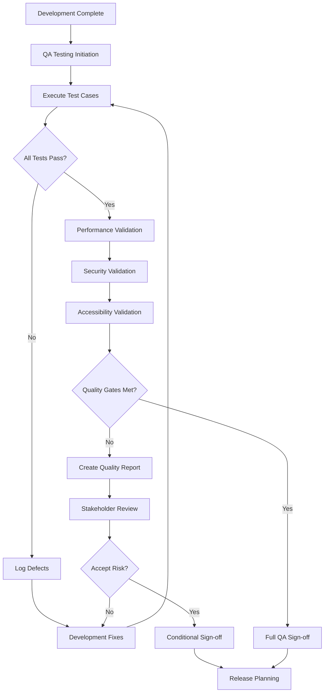

# QA Sign-off Procedures

## Document Information
- **Document Version:** 1.0
- **Last Updated:** 2025-09-13
- **Approved By:** [QA Lead Name]
- **Next Review:** 2025-12-13

## Table of Contents
1. [Overview](#overview)
2. [Sign-off Process](#sign-off-process)
3. [Quality Gates](#quality-gates)
4. [Sign-off Criteria](#sign-off-criteria)
5. [Stakeholder Responsibilities](#stakeholder-responsibilities)
6. [Documentation Requirements](#documentation-requirements)
7. [Escalation Procedures](#escalation-procedures)

## Overview

### Purpose
This document defines the Quality Assurance sign-off procedures for the Waste Sorting Assistant application, ensuring consistent quality validation before releases and deployments.

### Scope
These procedures apply to:
- Feature releases (major and minor)
- Hotfixes and patches
- Environment deployments (dev → qa → staging → production)
- Third-party integrations
- Security updates

### Quality Philosophy
> "Quality is not an act, it is a habit" - Aristotle

Our QA sign-off process ensures:
- **Consistency:** Standardized validation across all releases
- **Traceability:** Clear audit trail of quality decisions
- **Accountability:** Defined responsibility for quality outcomes
- **Risk Mitigation:** Systematic identification and management of quality risks

## Sign-off Process

### Process Overview


### Sign-off Phases

#### Phase 1: Feature Testing Sign-off
**Trigger:** Feature development completion
**Duration:** 2-3 business days
**Stakeholders:** QA Team, Development Team, Product Owner

**Activities:**
- [ ] Functional testing completion
- [ ] Integration testing validation
- [ ] User story acceptance criteria verification
- [ ] Cross-platform compatibility testing
- [ ] Basic performance validation

**Deliverables:**
- Feature Test Report
- Defect Summary
- Test Coverage Report

#### Phase 2: Sprint/Release Testing Sign-off
**Trigger:** Sprint completion or release candidate ready
**Duration:** 3-5 business days
**Stakeholders:** QA Team, Tech Lead, Product Owner, Stakeholders

**Activities:**
- [ ] Regression testing execution
- [ ] End-to-end scenario validation
- [ ] Performance benchmarking
- [ ] Security testing completion
- [ ] Accessibility compliance verification

**Deliverables:**
- Sprint Test Summary
- Performance Test Report
- Security Test Report
- Accessibility Test Report

#### Phase 3: Production Release Sign-off
**Trigger:** Release candidate finalization
**Duration:** 1-2 business days
**Stakeholders:** QA Lead, Tech Lead, Product Owner, Release Manager

**Activities:**
- [ ] Production readiness checklist
- [ ] Final smoke testing
- [ ] Rollback procedure validation
- [ ] Monitoring and alerting verification
- [ ] Documentation completeness review

**Deliverables:**
- Release Readiness Report
- QA Sign-off Certificate
- Risk Assessment Summary

## Quality Gates

### Gate 1: Development Quality Gate
**Criteria:**
- [ ] Code review completed and approved
- [ ] Unit test coverage ≥85%
- [ ] Static code analysis passed
- [ ] No critical security vulnerabilities
- [ ] Build succeeds on all target platforms

**Sign-off Authority:** Tech Lead
**Required for:** Promotion to QA environment

### Gate 2: Functional Quality Gate
**Criteria:**
- [ ] All planned test cases executed
- [ ] No P0 (critical) defects open
- [ ] ≤2 P1 (high) defects open with approved workarounds
- [ ] User acceptance criteria validated
- [ ] Cross-platform functionality verified

**Sign-off Authority:** QA Lead
**Required for:** Promotion to staging environment

### Gate 3: Performance Quality Gate
**Criteria:**
- [ ] App launch time <3 seconds (cold start)
- [ ] Image processing time <5 seconds
- [ ] Memory usage <150MB peak
- [ ] Battery impact within acceptable limits
- [ ] Network usage optimized

**Sign-off Authority:** Performance Team Lead
**Required for:** Production release approval

### Gate 4: Security Quality Gate
**Criteria:**
- [ ] Security scan completed with no high-risk findings
- [ ] Data encryption validated
- [ ] Authentication mechanisms verified
- [ ] Privacy compliance confirmed
- [ ] Penetration testing passed (quarterly)

**Sign-off Authority:** Security Team Lead
**Required for:** Production release approval

### Gate 5: Accessibility Quality Gate
**Criteria:**
- [ ] Screen reader compatibility verified
- [ ] Color contrast compliance (WCAG 2.1 AA)
- [ ] Touch target size requirements met
- [ ] Font scaling support validated
- [ ] Focus management tested

**Sign-off Authority:** Accessibility Specialist
**Required for:** Production release approval

### Gate 6: Business Quality Gate
**Criteria:**
- [ ] Business requirements validated
- [ ] User acceptance testing completed
- [ ] Success metrics defined and measurable
- [ ] Support documentation prepared
- [ ] Training materials ready (if required)

**Sign-off Authority:** Product Owner
**Required for:** Production release approval

## Sign-off Criteria

### Full Sign-off Criteria (Green Light)
All conditions must be met for full approval:

**Functional Requirements:**
- [ ] 100% of planned features implemented
- [ ] All user stories meet acceptance criteria
- [ ] No open P0 (critical) defects
- [ ] ≤2 open P1 (high) defects with approved workarounds
- [ ] All regression tests passing

**Non-Functional Requirements:**
- [ ] Performance benchmarks met or exceeded
- [ ] Security requirements satisfied
- [ ] Accessibility standards compliant
- [ ] Cross-platform compatibility validated
- [ ] Documentation complete and accurate

**Process Requirements:**
- [ ] All quality gates passed
- [ ] Required approvals obtained
- [ ] Risk assessment completed
- [ ] Rollback procedures tested
- [ ] Monitoring and alerting configured

### Conditional Sign-off Criteria (Yellow Light)
May proceed with documented risks and mitigation plans:

**Acceptable Conditions:**
- [ ] Minor P2 defects present with documented impact
- [ ] Performance slightly below target with improvement plan
- [ ] Non-critical features delayed to future release
- [ ] Limited device/platform coverage with known limitations
- [ ] Documentation gaps with completion timeline

**Required Documentation:**
- [ ] Risk register with mitigation strategies
- [ ] Known issues documentation
- [ ] Stakeholder approval of conditional release
- [ ] Timeline for addressing open items
- [ ] Customer communication plan

### No Sign-off Criteria (Red Light)
Release blocked until issues resolved:

**Blocking Conditions:**
- [ ] Any P0 (critical) defects open
- [ ] >2 P1 (high) defects without workarounds
- [ ] Core functionality not working
- [ ] Security vulnerabilities present
- [ ] Legal/compliance issues identified
- [ ] Performance unacceptable for target users

## Stakeholder Responsibilities

### QA Team Responsibilities
- **QA Lead:**
  - Final sign-off authority for functional quality
  - Risk assessment and escalation decisions
  - Quality metrics tracking and reporting
  - Cross-team coordination for sign-off process

- **QA Engineers:**
  - Test execution and validation
  - Defect identification and reporting
  - Test documentation maintenance
  - Quality data collection and analysis

### Development Team Responsibilities
- **Tech Lead:**
  - Code quality validation and sign-off
  - Technical risk assessment
  - Development readiness confirmation
  - Performance optimization approval

- **Developers:**
  - Unit testing completion
  - Code review participation
  - Defect resolution
  - Technical documentation updates

### Product Team Responsibilities
- **Product Owner:**
  - Business requirements validation
  - User acceptance criteria approval
  - Feature prioritization decisions
  - Customer impact assessment

- **Product Manager:**
  - Release planning and coordination
  - Stakeholder communication
  - Success criteria definition
  - Market readiness validation

### Operations Team Responsibilities
- **DevOps Lead:**
  - Deployment readiness validation
  - Infrastructure monitoring setup
  - Rollback procedure verification
  - Environment management approval

- **Site Reliability Engineer:**
  - Performance monitoring validation
  - Alerting configuration verification
  - Capacity planning approval
  - Operational readiness confirmation

## Documentation Requirements

### Sign-off Documentation Checklist

#### Pre-Sign-off Documents (Required)
- [ ] **Test Plan:** Comprehensive testing strategy and scope
- [ ] **Test Cases:** Detailed test scenarios and expected results
- [ ] **Test Data:** Prepared and validated test datasets
- [ ] **Environment Setup:** Test environment configuration guide
- [ ] **Entry Criteria:** Validation that testing can begin

#### Testing Phase Documents (Generated)
- [ ] **Test Execution Reports:** Daily/weekly testing progress
- [ ] **Defect Reports:** Detailed bug reports and status
- [ ] **Test Coverage Reports:** Code and requirement coverage
- [ ] **Performance Reports:** Performance benchmarking results
- [ ] **Security Reports:** Security testing outcomes

#### Post-Testing Documents (Required for Sign-off)
- [ ] **Test Summary Report:** Overall testing results and metrics
- [ ] **Quality Assessment:** Quality gates status and analysis
- [ ] **Risk Assessment:** Identified risks and mitigation strategies
- [ ] **Sign-off Certificate:** Formal approval documentation
- [ ] **Known Issues:** Documented limitations and workarounds

### Document Templates and Standards

#### Test Summary Report Template
```markdown
# Test Summary Report - [Release Version]

## Executive Summary
- Testing Period: [Start Date] to [End Date]
- Test Environment: [Environment Details]
- Testing Team: [Team Members]
- Overall Status: [PASS/CONDITIONAL/FAIL]

## Test Execution Summary
- Total Test Cases: [Number]
- Test Cases Executed: [Number] ([Percentage]%)
- Test Cases Passed: [Number] ([Percentage]%)
- Test Cases Failed: [Number] ([Percentage]%)
- Test Cases Blocked: [Number] ([Percentage]%)

## Quality Metrics
- Defect Density: [X defects per 1000 LOC]
- Test Coverage: [Percentage]%
- Performance Score: [Score/10]
- Security Rating: [High/Medium/Low Risk]

## Risk Assessment
[Summary of identified risks and mitigation strategies]

## Recommendation
[Sign-off recommendation with rationale]
```

#### QA Sign-off Certificate Template
```markdown
# QA Sign-off Certificate

**Release:** [Version Number]
**Date:** [Sign-off Date]
**QA Lead:** [Name and Signature]

## Quality Validation Confirmation
I hereby certify that the above release has undergone comprehensive quality assurance testing and meets the established quality standards for production deployment.

## Quality Gates Status
- [ ] Functional Quality Gate: PASSED
- [ ] Performance Quality Gate: PASSED
- [ ] Security Quality Gate: PASSED
- [ ] Accessibility Quality Gate: PASSED

## Risk Acknowledgment
All identified risks have been assessed, documented, and approved by relevant stakeholders.

## Authorization
This release is approved for production deployment.

**Signature:** [Digital Signature]
**Date:** [Date]
```

## Escalation Procedures

### Quality Issue Escalation Matrix

| Issue Severity | Response Time | Escalation Path | Decision Authority |
|----------------|---------------|-----------------|-------------------|
| P0 - Critical | 2 hours | QA Lead → Tech Lead → Engineering Manager | Engineering Manager |
| P1 - High | 24 hours | QA Lead → Product Owner → Product Manager | Product Manager |
| P2 - Medium | 3 days | QA Engineer → QA Lead | QA Lead |
| P3 - Low | 1 week | QA Engineer → QA Lead | QA Lead |

### Sign-off Dispute Resolution

#### Level 1: Team Resolution (2 business days)
- **Participants:** QA Lead, Tech Lead, Product Owner
- **Process:** Review quality data, assess risks, negotiate solutions
- **Authority:** QA Lead has final quality decision authority

#### Level 2: Management Resolution (3 business days)
- **Participants:** Engineering Manager, Product Manager, QA Manager
- **Process:** Business impact assessment, risk vs. opportunity analysis
- **Authority:** Engineering Manager with Product Manager consensus

#### Level 3: Executive Resolution (5 business days)
- **Participants:** VP Engineering, VP Product, CTO (if technical)
- **Process:** Strategic business decision, regulatory/legal considerations
- **Authority:** Executive team consensus

### Emergency Release Procedures

**Trigger Conditions:**
- Critical security vulnerability
- Major production outage
- Regulatory compliance requirement
- Customer-impacting data loss

**Process:**
1. **Immediate Assessment:** 30-minute impact evaluation
2. **Risk vs. Fix Analysis:** Business continuity assessment
3. **Accelerated Testing:** Critical path validation only
4. **Executive Approval:** CTO and VP Engineering sign-off
5. **Emergency Deployment:** With full rollback readiness
6. **Post-Mortem:** Within 24 hours of resolution

---

## Continuous Improvement

### Quality Metrics Review (Monthly)
- Test execution efficiency trends
- Defect escape rate analysis
- Sign-off process duration tracking
- Stakeholder satisfaction surveys

### Process Optimization (Quarterly)
- Sign-off criteria refinement
- Tool and automation improvements
- Training and skill development
- Industry best practices adoption

### Annual Process Audit
- Complete procedure review and update
- Compliance and regulatory alignment
- Stakeholder feedback incorporation
- Process maturity assessment

---

## Appendices

### Appendix A: Sign-off Checklist Templates
[Detailed checklists for each sign-off phase]

### Appendix B: Quality Metrics Definitions
[Comprehensive definitions of all quality metrics]

### Appendix C: Tool Integration Guidelines
[Integration with JIRA, TestRail, and other tools]

### Appendix D: Training Materials
[Links to training resources and certification programs]

---

**Document Control:**
- **Version:** 1.0
- **Last Review:** 2025-09-13
- **Next Review:** 2025-12-13
- **Owner:** QA Team
- **Approvers:** Engineering Management, Product Management